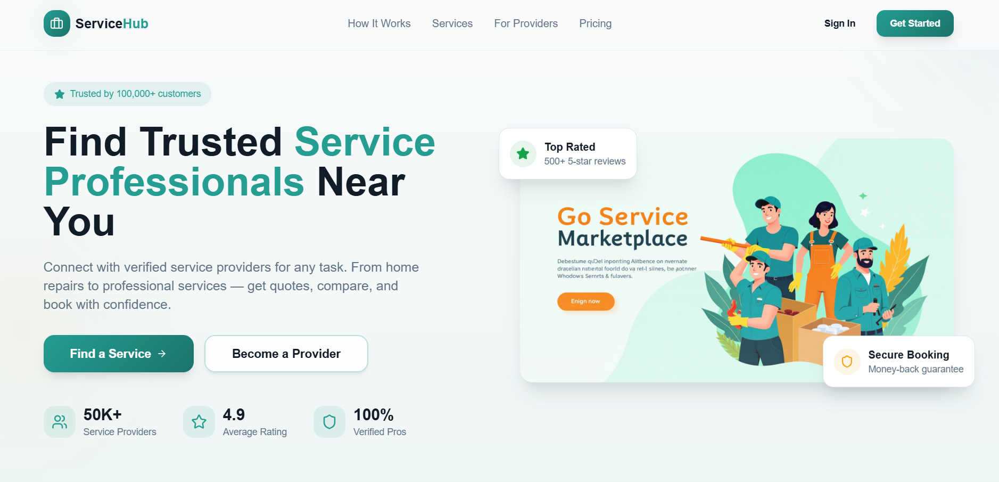
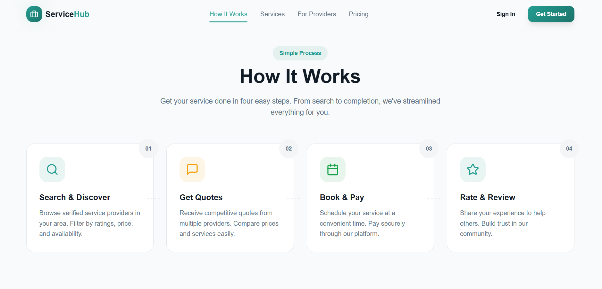
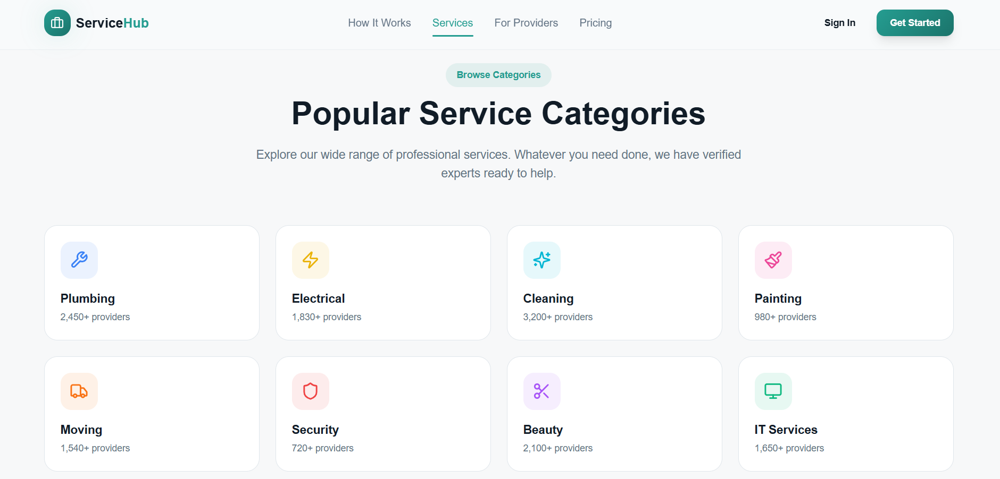
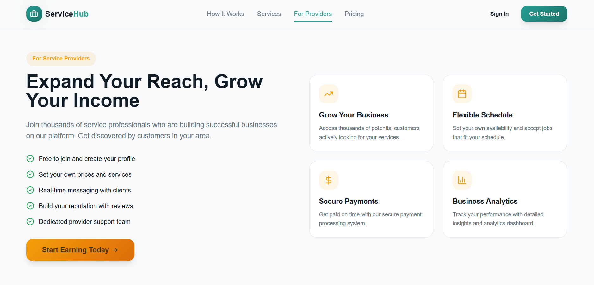
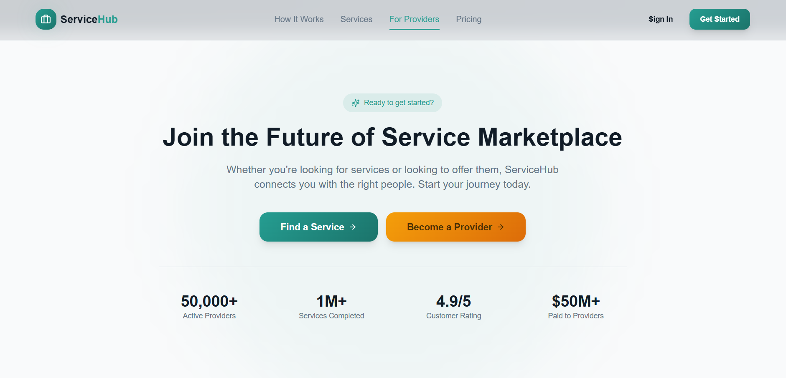
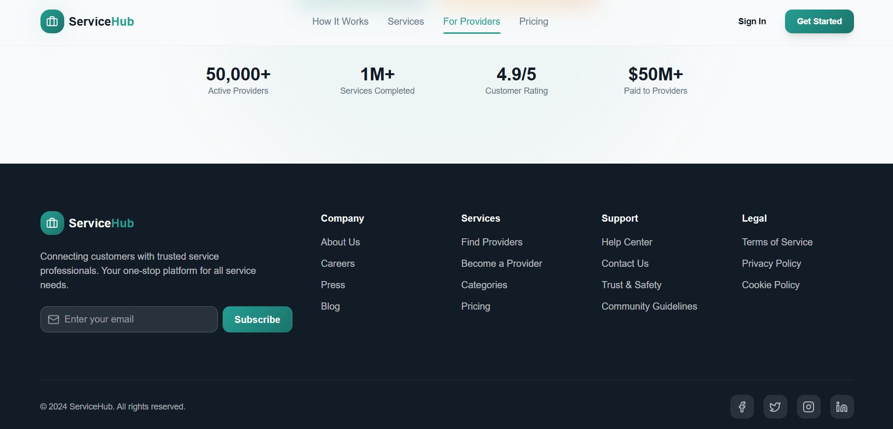

# 🌐 Service Website (React + Vite)

### Modern Frontend Web Application for Service Showcase

---

## 📌 Overview

The **Service Website** is a modern, fast, and responsive web application built using **React.js with Vite**. It is designed to showcase services in a clean and interactive way, providing users with a smooth browsing experience.

This project demonstrates:

* ⚛️ Component-based frontend architecture
* ⚡ High-performance development using Vite
* 🎨 Modern UI/UX design principles
* 🔄 Dynamic rendering with React

---
## 📸 UI Preview

<p align="center">
  
  
  
  
  
  
</p>
---

---

## 🚀 Key Features

### 🏠 Home Page

* Engaging landing section
* Service highlights
* Clean hero layout

---

### 🛠️ Services Section

* Display of multiple services
* Structured and reusable components
* Easy navigation between sections

---

### 📄 About Section

* Information about business/project
* Clean content layout

---

### 📞 Contact Section

* Contact form *(if implemented)*
* User interaction capability

---

### ⚡ Fast Performance

* Powered by **Vite** for:

  * Instant server start
  * Lightning-fast HMR (Hot Module Replacement)

---

## 🏗️ Project Structure

```id="reactstruct"
ServiceWebsite/
│
├── public/                 # Static assets
├── src/                    # Source code
│   ├── components/         # Reusable UI components
│   ├── pages/              # Page-level components
│   ├── App.jsx             # Main app component
│   ├── main.jsx            # Entry point
│
├── package.json            # Dependencies & scripts
├── vite.config.js          # Vite configuration
```

---

## 🖥️ Tech Stack

### ⚛️ Frontend

* React.js
* Vite

---

### 🎨 Styling

* CSS3 / Tailwind CSS *(if used)*

---

### 📦 Tools & Libraries

* Node.js
* npm / yarn

---

## 🎨 UI Features

* Modern and responsive layout
* Component-based design
* Smooth navigation
* Clean and minimal interface
* Reusable UI components

---

## 🔄 Application Flow

```id="reactflow"
1. App loads via Vite
2. React renders components
3. User navigates through sections
4. Components dynamically update UI
5. User interacts with forms/services
```

---

## 📂 Core Components Explained

### 📌 `main.jsx`

* Entry point of application
* Renders React app into DOM

---

### 📌 `App.jsx`

* Root component
* Manages routing/layout

---

### 📌 `components/`

* Reusable UI elements
* Buttons, cards, sections

---

### 📌 `pages/`

* Page-level views
* Home, Services, Contact

---

## ⚡ Installation & Setup

### 1️⃣ Clone Repository

```bash id="reactclone"
git clone https://github.com/your-username/service-website.git
cd service-website
```

---

### 2️⃣ Install Dependencies

```bash id="reactinstall"
npm install
```

---

### 3️⃣ Run Development Server

```bash id="reactrun"
npm run dev
```

---

### 4️⃣ Open in Browser

```id="reactopen"
http://localhost:5173/
```

---

## 📦 Build for Production

```bash id="reactbuild"
npm run build
```

---

## 📊 Use Cases

* 💼 Business service websites
* 🧑‍💻 Freelancer portfolios
* 🚀 Startup landing pages
* 📢 Product/service promotion

---

## 🌟 Highlights

✔ Built with modern React + Vite
✔ Fast and optimized performance
✔ Clean component-based architecture
✔ Scalable and maintainable code
✔ Portfolio-ready project

---

## 🧩 Future Enhancements

* 🌐 Add backend integration
* 🔐 User authentication
* 📊 Analytics dashboard
* 🌙 Dark mode support
* 📱 Fully responsive mobile design

---

## 👨‍💻 Author

**Vaibhav Sharma**

* Frontend Developer
* Passionate about building modern web applications

---

## 📜 License

This project is licensed under the **MIT License**.

---

This project highlights the power of **React + Vite** in building fast, scalable, and modern web applications.

---
